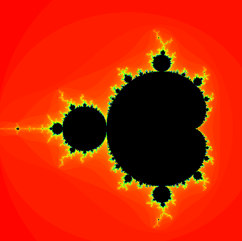

# Mandelbrot Set

The mandelbrot set consists of every number on the imaginary plane, where the following equation does not diverge:

$$z_{n+1} = z_{n}² + c$$

with:
$z,c$ ϵ $ℂ$, $z_0 = 0$, $c = x + iy$

In my implementation *"diverge"* is defined as $abs(z) \ge 2$

```java
void mandelbrot(double x, double y) {
    // scale
    x = reStart + (x / width) * (reEnd - reStart);
    y = imagStart + (y / height) * (imagEnd - imagStart);

    double zReal = 0;
    double zImag = 0;
    int iter = 0;

    while(iter < MAX_ITER) {
        if(absImag(zReal, zImag) >= 2) {
            break;
        }
        // z^2
        double real = Math.pow(zReal,2) - Math.pow(zImag,2);
        // + c
        zImag = 2*zImag*zReal + y;
        zReal = real + x;
        ++iter;
    }
    return iter;
}
```

## Coloring
### Grayscale:
For grayscale coloring i've choosen this calculation
```java
int grayscale = (int)(( (MAX_ITER - iteration) / (double)MAX_ITER ) * 255)
return color(grayscale);
``` 
With iteration being the iteration where the point diverged.

### Colors

For a more exciting look, I used this calculation
```java
colorMode(HSB);
int hue = (int)(255 * (double)iteration / MAX_ITER);
int value = iteration < MAX_ITER ? 255 : 0;
return color(hue, 255, value);
``` 
This results in following image of the mandelbrot set:

</img>

### Zooming

I've also implemented panning with the mouse and zooming with the scrollwheel.

Here is what that looks like

</img>