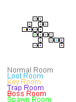

# Rogoulike Dungeon Generator

This is a dungeon / graph generator I've written a few years back for a school project.

It places the Spawn Room in the center of the map and builds the rooms outwards, trying to get less neighbors, the farther the room is from spawn. This enables the sort of branching pattern you would expect from a dungeon.

Then it searches the furthest room from spawn and sets it to be the boss room. Likewise, it gets the farthest room from the boss room and sets it to be the key room.

All the other rooms get randomly assigned NORMAL, TRAP or LOOT room.